<h1 align="center">Hi 👋, I'm Abdul Rahman Kole-Ibrahim</h1>

<h3 align="center">
Senior Mobile Engineer • Flutter • React Native • SwiftUI • Product Engineering
</h3>

Software engineer with 7+ years of experience building and shipping mobile and web products across healthcare, fintech, logistics, e-commerce, SaaS, AI, market research, and consumer technology.

I specialize in building scalable, production-ready applications with strong architecture, polished user experiences, reliable APIs, analytics, testing, security, and CI/CD.

  

---

# 👨🏽‍💻 About Me

- 📱 Senior Mobile Engineer specializing in **Flutter, React Native, SwiftUI, Dart, TypeScript, Swift, Kotlin, and C#**
- 🏗️ Experienced with **Clean Architecture, BLoC/Cubit, Riverpod, GetIt, Zustand, TanStack Query, and TDD**
- 🚀 Built and shipped production applications across **iOS, Android, Web, and Backend APIs**
- 🤖 Experienced with **AI/LLMs, audio processing, behavioral data, location services, analytics, and automation**
- 🔥 Experienced with **Firebase, AWS, REST APIs, OAuth 2.0, RevenueCat, StoreKit 2, Sentry, GA4, GTM, and Grafana**
- 🧪 Strong focus on **testing, security, performance, observability, analytics, and maintainable architecture**
- 👥 Experienced in **technical leadership, product delivery, implementation, and cross-functional collaboration**
- 💬 Ask me about **Flutter, React Native, Mobile Architecture, Firebase, CI/CD, Analytics, AI-powered apps, or Product Engineering**
- 📫 **Email:** [koleibrahimabdulrahman@gmail.com](mailto:koleibrahimabdulrahman@gmail.com)
- 🌐 **Portfolio:** [koleibrahim.com](https://www.koleibrahim.com/)
- 💼 **LinkedIn:** [Abdul Rahman Kole-Ibrahim](https://www.linkedin.com/in/abdulrahmanki/)

---

# 🚀 Selected Projects & Products

## 📊 L&E Opinions

Participant-facing market research application designed to connect users with paid research studies and improve study matching, engagement, and research participation.

Worked across the mobile application, backend APIs, analytics, behavioral tracking, location services, security, gamification, and production releases.

- Built and maintained functionality across **iOS and Android**
- Implemented **BLoC** state management and **GetIt** dependency injection
- Integrated behavioral tracking to improve survey matching
- Implemented **end-to-end encryption** for API requests and responses
- Built deep-linking, rewards, and gamification flows
- Developed location capture and background coordinate batching
- Built supporting **C#/.NET APIs**
- Developed analytics and event-tracking services
- Surfaced usage data through **Grafana**
- Managed mobile releases using **Codemagic**
- Introduced **Shorebird** for over-the-air updates

**Tech:** Flutter • Dart • BLoC • GetIt • C# • .NET • SQL Server • AWS • REST APIs • Codemagic • Shorebird • Grafana

🌐 **Website:** [leopinions.com](https://www.leopinions.com/)

🍎 **App Store:** [Download L&E Opinions for iOS](https://apps.apple.com/us/app/l-e-opinions/id6743765840)

🤖 **Google Play:** [Download L&E Opinions for Android](https://play.google.com/store/apps/details?id=com.l_and_e.member_portal_app)

---

## 🥗 Nourical

AI-powered nutrition platform designed to make food and health tracking easier through intelligent meal logging and personalized insights.

Users can log meals through **photo recognition, barcode scanning, or manual input**, track calories and macros, monitor health information, and receive nutrition guidance based on their goals.

**Tech:** Flutter • Dart • Firebase • AI/LLM Integration • RevenueCat • Apple Health • REST APIs

🌐 **Website:** [nourical.com](https://www.nourical.com/)

🍎 **App Store:** [Download Nourical for iOS](https://apps.apple.com/us/app/nourical/id6780682025)

🤖 **Google Play:** [Download Nourical for Android](https://play.google.com/store/apps/details?id=com.inaflow.nourical)

---

## 🩺 DoraScribe

AI-powered medical scribe designed to help clinicians reduce documentation time and spend more time focused on patient care.

The platform supports AI-assisted clinical documentation, transcription, structured medical notes, and healthcare workflows.

**Tech:** React Native • TypeScript • Firebase • AI/LLM Integration • Audio Processing • Shorebird • REST APIs

🌐 **Website:** [dorascribe.ai](https://dorascribe.ai/)

🍎 **App Store:** [Download DoraScribe for iOS](https://apps.apple.com/us/app/dorascribe/id6751861797)

🤖 **Google Play:** [Download DoraScribe for Android](https://play.google.com/store/apps/details?id=app.dorascribe.ai)

---

## 🧠 ZoeMD

AI-powered clinical decision-support application designed for healthcare professionals.

ZoeMD helps clinicians access medical information and intelligent clinical guidance while supporting premium subscription-based functionality across mobile platforms.

**Tech:** React Native • TypeScript • AI/LLM Integration • RevenueCat • StoreKit 2 • Firebase • REST APIs

- Implemented **auto-renewable subscription flows**
- Integrated **RevenueCat** for subscription management
- Worked with **StoreKit 2** and Apple In-App Purchase requirements
- Built and supported mobile subscription experiences

🌐 **Website:** [zoemed.ai](https://zoemed.ai/)

🍎 **App Store:** [Download ZoeMD for iOS](https://apps.apple.com/us/app/zoemd/id6747631441)

🤖 **Google Play:** [Download ZoeMD for Android](https://play.google.com/store/apps/details?id=com.zoemd.app)

---

## 🛒 PricyTag

Smart price-comparison application helping shoppers compare prices across retailers and make better purchasing decisions.

Users can search for products, scan barcodes in-store, track items on a wishlist, receive price-drop alerts, discover coupons, and access personalized deals.

**Focus:** Price Comparison • Barcode Scanning • Price Tracking • Coupons • Push Notifications • APIs • Analytics • Personalized Shopping

🌐 **Website:** [pricytag.com](https://www.pricytag.com/)

🍎 **App Store:** [Download PricyTag for iOS](https://apps.apple.com/us/app/pricy-tag/id6758889846)

🤖 **Google Play:** [Download PricyTag for Android](https://play.google.com/store/apps/details?id=com.pricy.tag)

---

## 🎧 Quran Pods

AI-assisted Qur’an reflection application designed to help users build a more personal and consistent connection with the Qur’an through personalized audio experiences.

Users can explore Qur’anic passages, topics, feelings, and questions while receiving audio reflections grounded in selected verses.

**Focus:** AI-assisted Experiences • Audio • Personalized Content • Mobile Product Development

- Personalized audio reflections
- Qur’anic Arabic and translations
- Background audio playback
- Adjustable playback speed
- Saved moments and personal notes
- Listening history
- Listening streaks and engagement tracking

🤖 **Google Play:** [Download Quran Pods for Android](https://play.google.com/store/apps/details?id=com.quranpods.app)

---

## 🛍️ Yayako — Yayako Express Limited

Worked across the **Yayako Express Limited digital commerce ecosystem**, spanning customer-facing and seller-facing experiences across both **web and mobile**.

The platform connects customers with vendors while giving merchants tools for managing products, orders, payments, inventory, payouts, and day-to-day business operations.

### 🌐 Yayako Customer Web Platform

Worked on the customer-facing e-commerce experience where users can browse products, discover vendors, place orders, and manage their shopping experience.

🌐 **Website:** [yayakoexpress.com](https://yayakoexpress.com/)

### 🛒 Yayako Customer Mobile App

**Focus:** E-commerce • Multi-vendor Marketplace • Product Discovery • Payments • Order Tracking • Mobile Commerce

🍎 **App Store:** [Download Yayako for iOS](https://apps.apple.com/us/app/yayako/id6744727249)

🤖 **Google Play:** [Download Yayako for Android](https://play.google.com/store/apps/details?id=com.yayako.yayako)

### 🏪 Yayako Seller Web Platform

Worked on the dedicated seller portal, giving vendors a web-based interface for managing their businesses and marketplace operations.

🌐 **Seller Portal:** [seller.yayakoexpress.com](https://seller.yayakoexpress.com/)

### 📱 Yayako Seller Mobile App

- Product creation and management
- Inventory management
- Real-time order management
- Wallets and payouts
- Business profile management
- Bank account management
- Sales analytics and reporting

🍎 **App Store:** [Download Yayako Seller for iOS](https://apps.apple.com/us/app/yayako-seller/id6747959852)

🤖 **Google Play:** [Download Yayako Seller for Android](https://play.google.com/store/apps/details?id=com.yayako.vendor.app)

---

## 📍 BuzzMap

Worked on the **first version of BuzzMap**, a location-driven event discovery platform designed to help users discover what is happening around them in real time.

The initial product experience focused on interactive maps, nearby events, trending hotspots, location-aware discovery, and helping users explore activities around their city.

**Focus:** Event Discovery • Location Services • Interactive Maps • Real-time Activity • Personalized Discovery • MVP Development

- Contributed to the **first version and early mobile experience**
- Worked on location-driven event discovery flows
- Helped build map-based experiences for discovering nearby activities
- Contributed to the early foundation for real-time and trending event discovery

🌐 **Website:** [buzzmap.org](https://buzzmap.org/)

🍎 **App Store:** [Download BuzzMap for iOS](https://apps.apple.com/us/app/buzzmap/id6581480318)

🤖 **Google Play:** [Download BuzzMap for Android](https://play.google.com/store/apps/details?id=com.nodescale.buzzmap)

---

## 💻 LeanSoftWorks

Custom software and digital product company focused on helping startups and businesses design, build, and launch scalable technology products.

Worked on digital experiences supporting **custom software, mobile applications, web applications, and AI-enabled solutions**.

**Focus:** Custom Software • AI Solutions • Mobile Development • Web Development • Product Engineering

🌐 **Website:** [leansoftworks.com](https://leansoftworks.com/)

---

## 💻 Inaflow

Digital product agency helping startups and businesses transform ideas into scalable digital products and experiences.

Inaflow works across **product strategy, UI/UX design, branding, mobile development, web development, analytics, and digital growth**.

**Focus:** Product Strategy • UI/UX • Mobile Development • Web Development • Branding • Analytics • Digital Growth

🌐 **Website:** [inaflow.ca](https://inaflow.ca/)

---

## 🎂 Reefat Pastries

Worked on the customer-facing website and digital experience for **Reefat Pastries**, a cakes, pastries, small-chops, and catering business.

The website serves as a digital storefront for showcasing products and services while helping customers discover and connect with the business.

**Focus:** Web Development • Responsive Design • Digital Storefront • UI/UX • Business Digital Presence

🌐 **Website:** [reefatpastries.com](https://www.reefatpastries.com/)

---

## 🚚 Faramove

Logistics platform supporting customer, driver, and operational workflows across delivery and transportation services.

Worked across mobile experiences covering real-time tracking, dispatching, notifications, logistics workflows, and operational efficiency.

- Supported **24,000+ users**
- Built and shipped customer and driver applications
- Improved operational productivity by approximately **30%**
- Implemented push notifications and in-app messaging
- Helped improve engagement by approximately **30%**
- Added crash monitoring and reliability improvements
- Built real-time logistics and location-tracking functionality
- Contributed to dispatching and route optimization

**Tech:** Flutter • Dart • BLoC/Cubit • GetIt • Firebase • Google Maps • Node.js • MongoDB • Codemagic

🌐 **Website:** [faramove.com](https://faramove.com/)

### 📦 Faramove Customer App

🍎 **App Store:** [Download Faramove for iOS](https://apps.apple.com/us/app/faramove-express-logistics/id1641475229)

🤖 **Google Play:** [Download Faramove for Android](https://play.google.com/store/apps/details?id=com.faramove.user)

### 🚗 Faramove Driver

🍎 **App Store:** [Download Faramove Driver for iOS](https://apps.apple.com/ng/app/faramove-driver/id1641013027)

🤖 **Google Play:** [View Faramove Apps](https://play.google.com/store/apps/developer?id=FARAMOVE)

---

## 🛒 Jeetar

Worked on **Jeetar**, an e-commerce super app designed to provide fast access to groceries, food, medicine, fuel, local products, and other everyday essentials.

The platform was built around a rapid-delivery model and included multiple connected mobile applications supporting customers and merchants.

- Led development from **ideation through launch**
- Built three connected Flutter applications across iOS and Android
- Developed customer, vendor, and merchant experiences
- Integrated **Flutterwave** and **Paystack** for payments
- Supported the onboarding of **4,000+ users**
- Helped generate approximately **$85,000 in revenue**
- Contributed to approximately **30% growth in sales**

**Tech:** Flutter • Dart • Firebase • Flutterwave • Paystack • REST APIs • Firebase Analytics

---

## 💱 Reyts

Worked on **Reyts**, a fintech platform designed to make peer-to-peer currency exchange simpler, faster, and more secure.

The product enables users to exchange currencies directly while providing secure transaction flows and a streamlined mobile experience.

- Worked across mobile architecture, payments, authentication, and transaction flows
- Helped increase **transaction volume by approximately 50%**
- Contributed to approximately **30% growth in revenue**
- Improved application stability and production reliability
- Helped reduce crashes by approximately **25%**
- Strengthened application security
- Helped reduce identified vulnerabilities by approximately **50%**
- Implemented secure authentication using **OAuth 2.0**
- Worked with biometric authentication and secure transactions
- Applied **Clean Architecture**, BLoC, dependency injection, and automated testing
- Used **Sentry** for production monitoring
- Used **Shorebird** for over-the-air updates

**Tech:** Flutter • Dart • BLoC • Clean Architecture • OAuth 2.0 • Biometrics • GetIt • Sentry • Shorebird • REST APIs • TDD

🌐 **Website:** [reyts.com](https://www.reyts.com/)

🍎 **App Store:** [Download Reyts for iOS](https://apps.apple.com/ca/app/reyts/id6477858140)

🤖 **Google Play:** [Download Reyts for Android](https://play.google.com/store/apps/details?id=com.reyts.exchange)

---

## 🛍️ Roppi

Hyper-local commerce and delivery platform connecting customers with nearby businesses and products.

The application supports local product discovery, ordering, pickup, location-aware shopping, and last-mile delivery experiences.

**Tech:** Flutter • Dart • Firebase • Google Maps • REST APIs • Push Notifications

🌐 **Website:** [roppi.co](https://www.roppi.co/)

🍎 **App Store:** [Download Roppi for iOS](https://apps.apple.com/us/app/roppi-groceries-food-more/id1665627558)

🤖 **Google Play:** [Download Roppi for Android](https://play.google.com/store/apps/details?id=com.roppi.superapp)

---

# 🛠️ Languages & Technologies

## 📱 Mobile Development

  

`Flutter` • `React Native` • `SwiftUI` • `Expo` • `Dart` • `TypeScript` • `Swift` • `Kotlin`

---

## 🌐 Web & Backend

  

`Next.js` • `React` • `Node.js` • `.NET` • `C#` • `JavaScript` • `TypeScript` • `REST APIs` • `OpenAPI / Swagger`

---

## 🏗️ Architecture & State Management

`Clean Architecture` • `BLoC` • `Cubit` • `Riverpod` • `GetIt` • `Zustand` • `TanStack Query` • `TDD`

---

## ☁️ Cloud, Data & DevOps

  

`Firebase` • `AWS` • `Google Cloud Platform` • `GitHub Actions` • `Codemagic` • `Fastlane` • `Shorebird` • `Bitbucket`

---

## 📊 Analytics & Observability

`GA4` • `Google Tag Manager` • `Firebase Analytics` • `Firebase Crashlytics` • `PostHog` • `Sentry` • `Hotjar` • `Grafana`

---

## 💳 Payments & Subscriptions

`RevenueCat` • `StoreKit 2` • `Flutterwave` • `Paystack` • `Stripe` • `In-App Purchases`

---

## 🧪 Testing & Quality

`Unit Testing` • `Integration Testing` • `Mockito` • `TDD` • `CI/CD`

---

## 🧰 Tools

  

`Android Studio` • `Xcode` • `VS Code` • `Figma` • `Postman` • `Jira` • `Confluence`

---

# 📈 GitHub Stats

  
  

  

  
    Stats are generated daily from repositories accessible to my GitHub account.
  

---

# 🤝 Connect With Me

  
  
  

 

  <strong>Building reliable mobile and web products from idea to production.</strong>

  
    Flutter • React Native • SwiftUI • Product Engineering • AI-powered Applications
  

